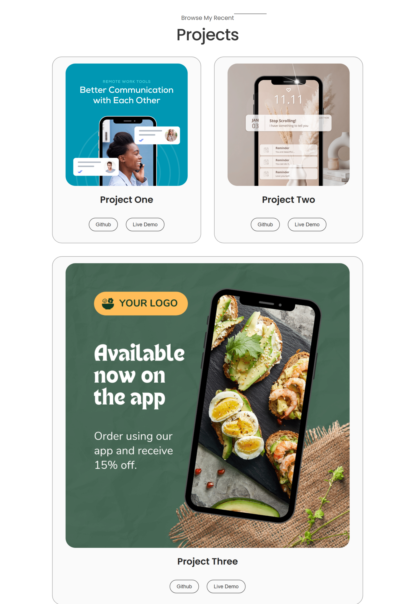
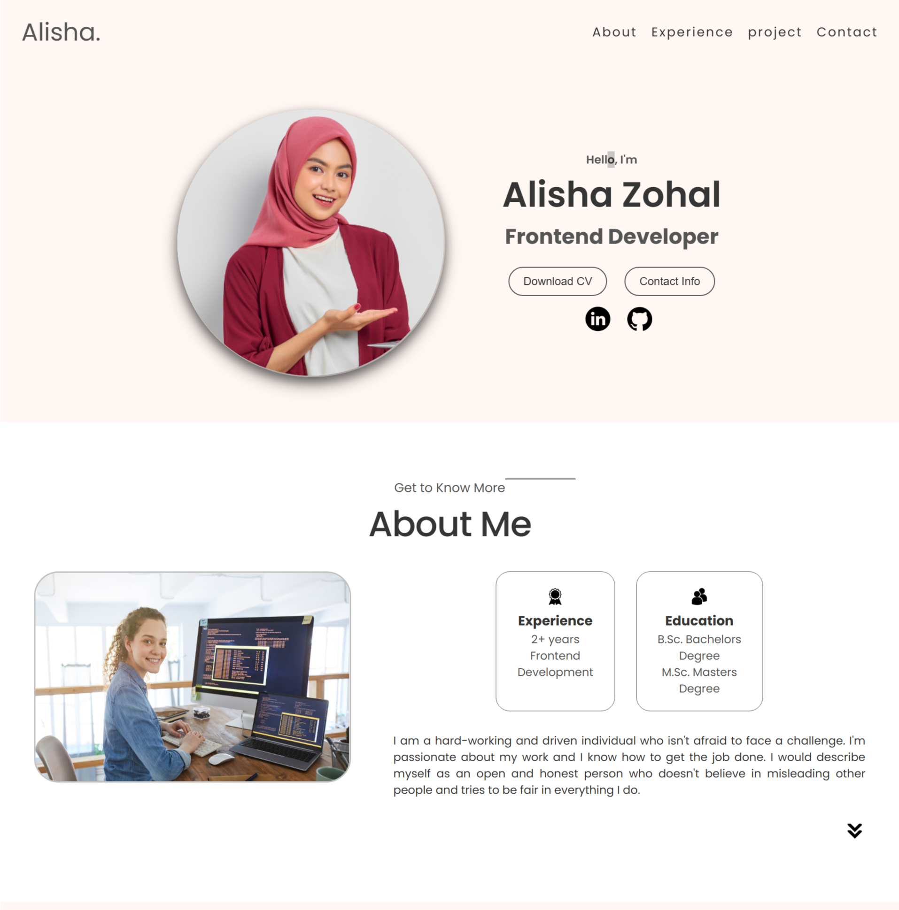

   &nbsp;
  

# Alisha-Zohal Portfolio Website
A responsive and visually appealing personal portfolio website showcasing projects, skills, and contact information. Built with HTML, CSS, JavaScript.

## Features
- **Responsive Design**: Works seamlessly on desktop, tablet, and mobile devices.
- **Home Section**: Introduction and hero banner.
- **About Section**: Information about the developer.
- **Projects Section**: Displays completed projects with links.
- **Contact Section**: Contact form for inquiries.
- **Navigation Bar**: Smooth scrolling to different sections.
- **Interactive UI**: Attractive hover effects and animations.
- 
## Technologies Used
- HTML5
- CSS3
- CSS FlexBox & Grid
- Media Query for Responsive Design
- JavaScript

## Live Demo
[View Live Portfolio](https://webbyhosna.github.io/alisha-zohal-portfolio/)

## Installation
1. Clone the repository:  
   `git clone https://github.com/webbyhosna/alisha-zohal-portfolio.git`
2. Open `index.html` in your browser.

## Author
[Asma Ul Hosna](https://github.com/webbyhosna)
